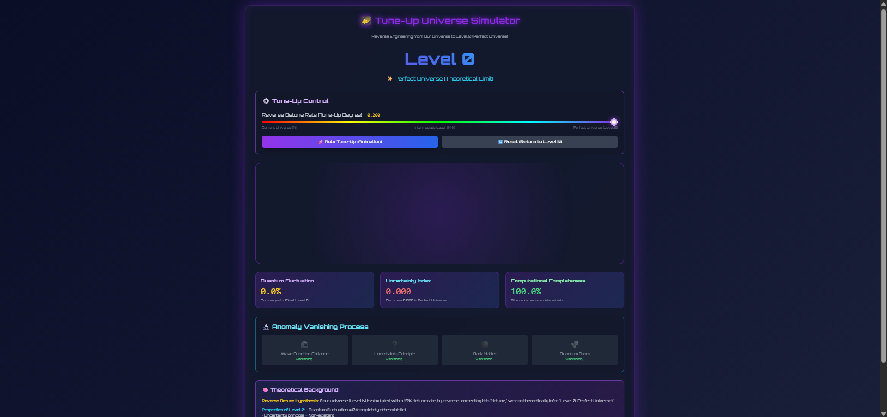

# 🌠 Tune-Up Universe Simulator

**Reverse-engineering our detuned reality toward *Level 0* — the Perfect Universe.**

> “If our universe is a 15% detuned simulation, what happens when we *tune it back up*?”

---

## Live Demo

[https://snowbellsan.github.io/tune-up-universe/](https://snowbellsan.github.io/tune-up-universe/)

*(Open in any browser. No install. No server. No tracking.)*

---

## Concept

| Layer | State |
|------|-------|
| **Level N** | Our Universe — quantum noise, uncertainty, freedom |
| **Level 0** | Perfect Universe — **zero fluctuation, zero uncertainty, full determinism** |

Slide the **Reverse Detune Rate** to watch anomalies vanish and the cosmos converge on absolute order.

---

## Features

- **Real-time visualization** of quantum noise fading
- **Anomaly tracker** — watch wave collapse, uncertainty, dark matter disappear
- **Auto Tune-Up animation** — watch the universe evolve to perfection
- **Metrics panel**:
  - Quantum Fluctuation → 0%
  - Uncertainty Index → 0.000
  - Computational Completeness → 100%

---

## Theoretical Background

> **Reverse Detune Hypothesis**  
> If our universe runs at ~15% detune (resource-saving optimization), *tuning it up* reveals the underlying **Level 0** — a fully deterministic, infinitely costly simulation.

### Properties of Level 0
- Quantum fluctuation = **0**
- Uncertainty principle = **non-existent**
- Wave function collapse = **unnecessary**
- Dark matter/energy = **computational artifacts**
- Free will = **illusion**

> **Epistemological Limit**:  
> We are detuned observers. True observation of Level 0 is *mathematically impossible*.  
> This is **imaginative extrapolation**.

---

## Screenshots

| Current Universe (Level N) | Approaching Level 0 |
|----------------------------|---------------------|
|  |  |

---

## Companion Project

**[detune-universe-observer](https://github.com/snowbellsan/detune-universe-observer)**  
→ The *chaotic* counterpart. Slide **up** to break reality.

---

## Tech

- HTML + Tailwind CSS
- Vanilla JS
- 1 file. 0 dependencies.

---

## Author

**snowbellsan**    ( https://x.com/Jackpot_jack     habukumohakirabu@gmail.com )  
*Simulator Archaeologist | AI Conductor | One-sentence Philosopher*

> “I said: *‘Remove uncertainty and quantum noise.’*  
> AI built the rest.  
> The idea did everything.”

---

## License

[MIT](./LICENSE)

---

> **Tune up to perfection.**  
> **Lose your freedom.**  
> **Choose wisely.**

---
